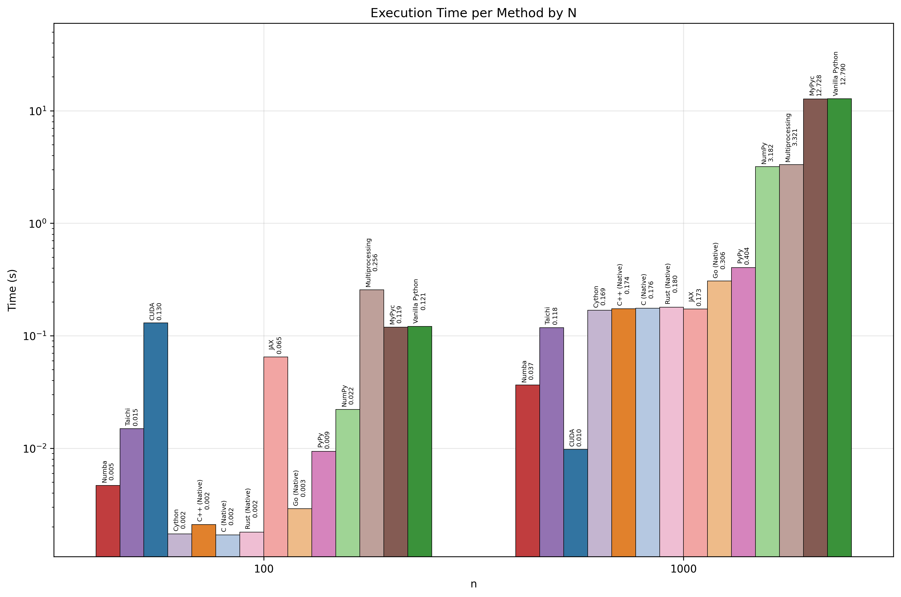
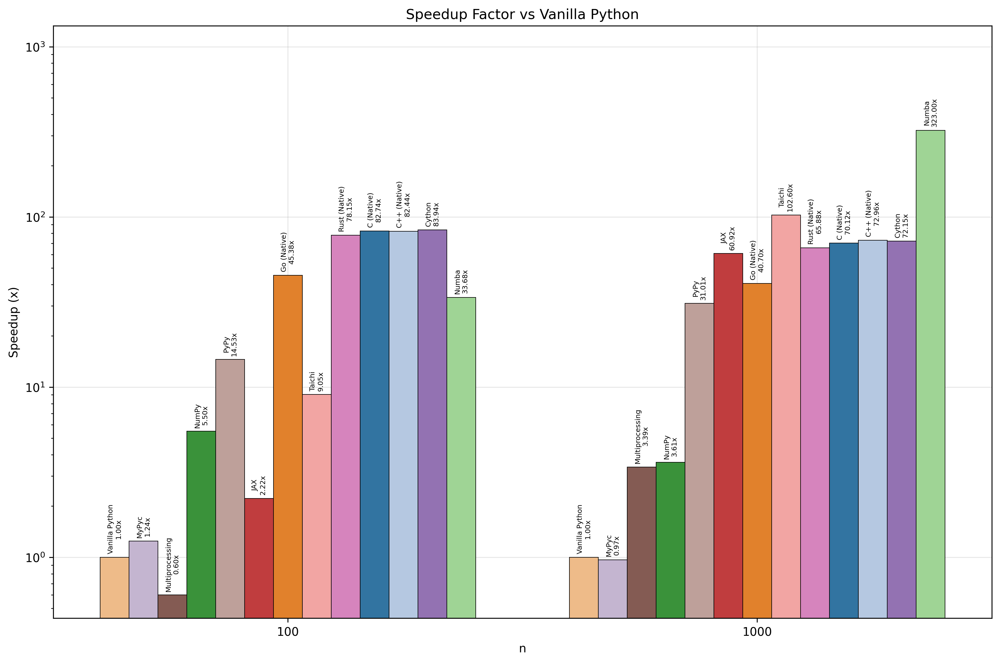

# Python Doesn't Need To Be Slow

Welcome to the **Python Speed-Up Benchmark** project! 

The goal of this repository is to explore and compare various methods for accelerating Python code, using the classic **N-Body Simulation** as our test case. We also include native implementations in C, C++, and Rust to serve as a high-performance baseline.

## The Problem: N-Body Simulation

An N-body simulation calculates the gravitational interaction between $N$ bodies. The computational complexity of the naive algorithm is $O(N^2)$, making it computationally expensive and a perfect candidate for optimization.

We simulate particles in a 3D space, calculating forces, velocities, and positions at each time step.

## Implementations

We have implemented the simulation using the following technologies:

### Python Ecosystem

1.  **Vanilla Python**
    - Reference implementation using standard lists and classes.
    - *Pros*: easy to read. *Cons*: very slow due to interpreter overhead.
2.  **NumPy**
    - Uses vectorized operations to push loops to C level.
    - *Pros*: cleaner code, significant speedup.
3.  **Numba**
    - JIT (Just-In-Time) compiler that translates Python functions to optimized machine code.
    - *Pros*: near-native speed with minimal code changes.
4.  **JAX**
    - Google's NumPy-compatible library with JIT compilation and functional programming.
    - *Pros*: XLA compilation, automatic vectorization, functional approach, GPU support.
5.  **Taichi Lang**
    - A high-performance compiler for computer graphics and simulation.
    - *Pros*: extremely fast, parallelizes on CPU/GPU automatically.
6.  **Cython**
    - Compiles Python-like code to C extensions.
    - *Pros*: robust, widely used. *Cons*: requires separate build step.
7.  **MyPyc**
    - MyPy's compiler that translates type-annotated Python to C extensions.
    - *Pros*: significant speedup with minimal code changes, leverages existing type hints.
8.  **PyPy**
    - Alternative Python implementation with a JIT (Just-In-Time) compiler.
    - *Pros*: significant speedup for pure Python code with no code changes required.
9.  **Multiprocessing**
    - Uses multiple CPU cores to parallelize the workload.
    - *Pros*: utilizes hardware. *Cons*: high overhead for process communication.

### Native Baselines

These serve as the "speed limit" to see how close our Python optimizations can get to raw machine performance.

- **Rust**
- **C**
- **C++**
- **Go**

## How to Run

> **Note:** Ensure you have Docker installed on your machine to run the benchmarks seamlessly.

Use the runner script to execute all benchmarks.

```bash
# Windows
.\run_benchmarks.bat

# Linux / macOS
./run_benchmarks.sh
```

To force rebuild all Docker images, use the `--force` flag.

## Results

After running the benchmarks, you can analyze the results using our analysis script:

```bash
python analysis.py
```

This generates performance comparison charts in the `figures/` directory.

### Performance Comparison



*Execution time comparison across different methods and problem sizes (N-body count)*



*Speedup factor relative to vanilla Python implementation*

---

*Happy Optimizing!*
